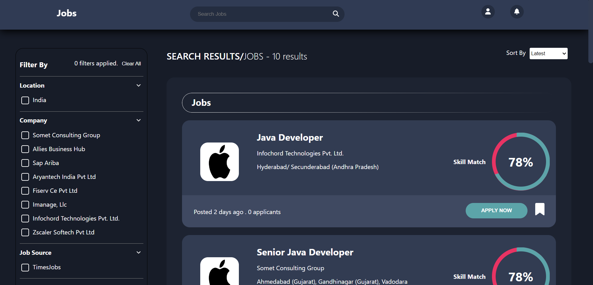

# Job Search
Welcome to the Job Search App repository! This comprehensive application is designed to streamline your job search process, allowing you to find your dream job with ease.

## Overview:
The Job Search App simplifies job hunting by enabling users to search for roles based on specific job titles. The app also offers advanced filtering options, including company, date posted, experience level, salary range, and required skills.

## Features:
- Search jobs by specific job roles.
- Apply filters to narrow down search results effectively.
- Customize filters based on company, experience, and more.
- User-friendly interface for intuitive navigation.

## Tech Stack:
- Frontend: React JS, HTML, CSS
- Data in js format

## Key Features:
- Precise job role-based searching.
- Advanced filters for tailored results.
- Seamless navigation for a user-friendly experience.

## Get Started
1. Clone this repository: `git clone https://github.com/Jaganath-MSJ/Job-Search.git`
2. Navigate to the project directory: `cd Job-Search`
3. Install dependencies: `npm install`
4. To Start: `npm start`
5. Open the app in your browser: `http://localhost:3000`

## Demo:
For a live demonstration, you can visit [Demo Link](https://msj-job-search.netlify.app).

## Contact:
Feel free to reach out to me via email at [jagan.msjc@gmail.com](mailto:jagan.msjc@gmail.com) or connect on [LinkedIn](https://www.linkedin.com/in/jaganathms).

## Thanks To
[Netlify](https://www.netlify.com)
